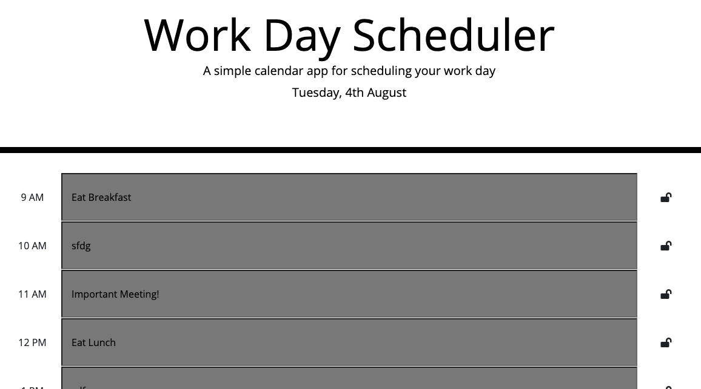

# Work Day Scheduler

The app represents a simple daily calendar that allows the user to save events for each hour of the working day (9AM-5PM). This app runs in the browser and features a dynamically updated HTML and CSS through jQuery.

We are also using the Moment library (see link below below) library to capture the current date and time.

https://momentjs.com/docs/

## link to site!

https://mmilici-star.github.io/daily-todo-list/

## User Story

User's will have the ability to add todo tasks to the calendar. List items can be saved by clicking the lock button (see below). This will store their inputs in local storage so that the page can be refreshed without losing the data.

## General Process

GIVEN I am using a daily planner to create a schedule
WHEN I open the planner
THEN the current day is displayed at the top of the calendar
WHEN I scroll down
THEN I am presented with timeblocks for standard business hours
WHEN I view the timeblocks for that day
THEN each timeblock is color coded to indicate whether it is in the past, present, or future
WHEN I click into a timeblock
THEN I can enter an event
WHEN I click the save button for that timeblock
THEN the text for that event is saved in local storage
WHEN I refresh the page
THEN the saved events persist

## Review

You are required to submit the following for review:

- The URL of the deployed application.

- The URL of the GitHub repository. Give the repository a unique name and include a README describing the project.

---

© 2019 Matt Milici, All Rights Reserved.
